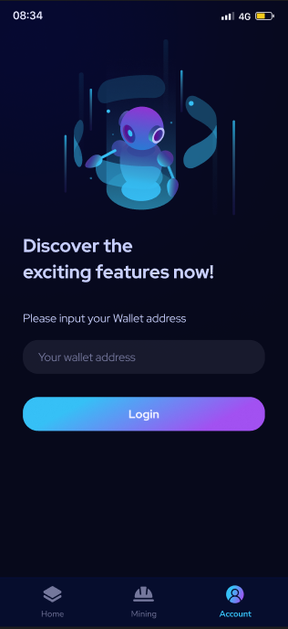
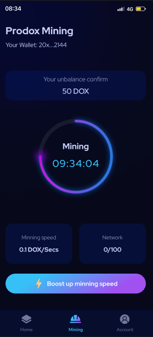

# 4⃣ How to mining


To learn more about $DOX Mining, check [check here](../prodox-system/features-details/earning-services/mining.md)


## STEP 1 - CREATE YOUR ACCOUNT

_(If you already had account, you can ignore this step)_

\=> [Learn here](creating-account.md)

## STEP 2 - INSTALL APP (ANDROID SUPPORT ONLY)

You can download APK Installing file in:

* Our treelink [https://linktr.ee/prodox](https://linktr.ee/prodox)
* Our website [https://prodox.io/](https://prodox.io/) (Scroll down to Mobile Device)
* Direct download [https://bit.ly/3Uhdck2](https://bit.ly/3Uhdck2)

## STEP 3: OPEN APP SIGN-IN & STARTING MINE

When opening app, at log-in area, paste your address and press login.

<figure><figcaption></figcaption></figure>

Go to page Mining, press Start Mining

<figure><figcaption>
<em>Note: UX may change depend on version of APP</em>
</figcaption></figure>

## VIDEO TUTORIAL



_(Uploading soon)_

