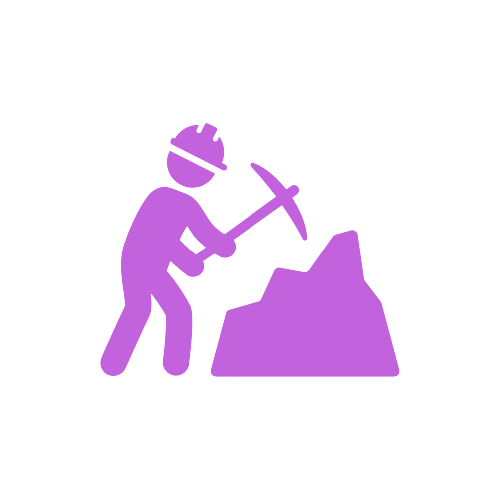

# ⛏ DOX Mining

Prodox Mining is based on BSC’s blockchain and rewards tokens similar to POS methods.

However, this will affect the miners who do not have enough DOX to stake and mine. Therefore, DOX chooses the mechanism according to the number of existing miners and divides it equally among everyone. Increasing mine speed depends on the network (Ref).

DOX will require a minimum stake of 1 amount of DOX to ensure that the miner is a holder.\
This amount of Stake will increase over time.\
The donation of Dox numbers to miners will be maintained by the fees of the service that Dox provides. This balances out PRODOX’s economic structures

<figure><figcaption></figcaption></figure>

