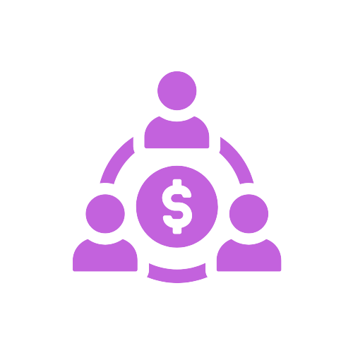

# 💰 P2P Lending

Borrower: A

Lender: B

A will use BTC/ETH/BNB (BEP20) as collateral to protect the loan

Loan will be Stable-coin (BUSD - USDT - USDC)

When A has a need to borrow money but does not want to sell Assets, A will submit a loan request to the dApp with the following parameters:

1-Amount A want to borrow

2-Loan interest rate (By day/week / month)

3-Prepaid penalty interest.

The loan amount will be up to a percentage of the collateral and valued at the market price at the time of the loan

When the loan amount is overdue for repayment or the loan amount is equal to the value of the collateral at the time of borrowing, the property will be liquidated to secure the loan.

B: when needing lending, will provide his capital source and the desired interest rate.

A and B can deal with each other, but this is anonymous to avoid money laundering (Lending itself to legitimize the source of money)

When A and B agree, a contract will proceed and will automatically lock the assets of the parties. After a certain period of time, A will receive the money. The exchange will lock the property. In case A pays late interest, the property will be partially sold to pay party B. And the asset value is lower than the safe threshold at that time, the property will be automatically liquidated and transferred to party B.

Another case is that if the property value is lower than the safe threshold, Party A will receive an email notification to finalize the property (no penalty). In case Party A does not proceed, the property will be self-liquidated to ensure loan safety.

Loan cost will use Prodox Token as transaction fee.

This transaction fee will automatically convert into Prodox Token and add to liquidity (Insurance Fund)

<figure><figcaption></figcaption></figure>
